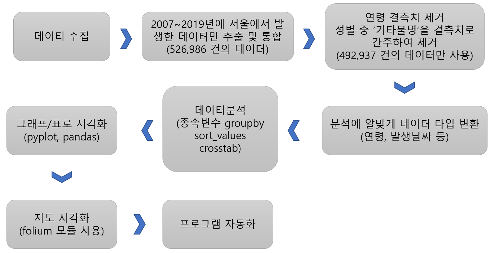

# TrafficAccidentAnalysis
## 2021년 1학기 빅데이터분석 텀프로젝트

## 1. 프로젝트 목표
- 서울에서 발생한 교통사고 데이터를 수집
- 개별 사고를 제공된 여러 변수로 그룹화
- 사망사고 발생에 영향을 주는 요인 찾기
- 분석한 데이터를 한눈에 알아볼 수 있도록 그래프와 표로 시각화
- 지도 위에 통계 데이터를 시각화
## 2. 연구 방법
### 1) 연구 데이터
- 교통사고분석시스템(TAAS)의 공공데이터 셋 
    - 서울경기 개별사고정보(2014_2019).xlsx (550,792 건)
    - 서울시 개별사고정보(2007_2009).xlsx (125,433 건)
    - 서울시 개별사고정보(2010_2018).xlsx (362,298 건)
- 서울시 열린데이터 광장
    - Seoul_population.txt (2007~2019년 서울시 자치구별 인구 데이터)
### 2) 연구 과정

## 3. 연구 결과
- [발표 자료 링크](텀프로젝트_결과발표.pdf)